# Ejemplo real · Peluquería Sol con el Método CDIA

Una web de turnos construida de punta a punta con el plugin **CDIA** (comunidad CDIA, cdia.pro), paso por paso, el 27 de septiembre de 2026. Cada paso se corrió en una sesión nueva de Claude Code, como enseña el método.

La idea de partida fue una sola frase: *"una web para que los clientes de mi peluquería, Peluquería Sol, reserven turnos"*.

> Esta fue una prueba automática del plugin: donde Claude tenía que preguntar, tomó su propia recomendación como respuesta. Usada por una persona, cada paso hace sus preguntas de a una. La web se publicó en Vercel para la prueba y después se dio de baja; estas capturas son de la versión publicada.

## El recorrido

| Paso | Comando | Qué dejó |
|---|---|---|
| Entrada | `/cdia:empezar` | Clasificó el pedido como **proyecto nuevo** y marcó el camino: preparar → brainstorming → plan → fases. |
| 0 · Preparar | — | No se corrió: la prueba arrancó sin GitHub. El [CLAUDE.md](proyecto/CLAUDE.md) lo armó la fase 1 y el repositorio se creó al publicar. En un proyecto real, este paso va primero. |
| 1 · Brainstorming | `/cdia:brainstorming` | [SPEC.md](proyecto/SPEC.md) con 19 requisitos que se pueden probar ("Cuando…, la app…") y [DECISIONES.md](proyecto/DECISIONES.md) con cada decisión y su porqué. Avisó en simple los dos límites de esta versión. |
| 2 · Plan | `/cdia:plan` | [PLAN.md](proyecto/PLAN.md): 3 fases, cada una con los recorridos concretos de "cómo se ve terminada", y una sección "Ojo con" (doble clic, símbolos raros en el nombre, cambio de día a medianoche, datos dañados). |
| 3 · Fase 1 | `/cdia:fase` | **HECHO** · reservar un turno de punta a punta, probado en el navegador, 10 pruebas automáticas, commit. |
| 3 · Fase 2 | `/cdia:fase` | **HECHO** · validaciones y agenda de la dueña con PIN, 16 pruebas, commit. |
| 3 · Fase 3 | `/cdia:fase` | **HECHO** · horario ocupado entre dos pestañas, aviso si no se puede guardar, diseño para celular. |
| 4 · Probar | `/cdia:probar` | Los 19 requisitos recorridos como un cliente, en compu y celular: **94 de 94 chequeos bien**, sin errores en la consola. |
| 5 · Revisar | `/cdia:revisar` | Un revisor independiente comparó todo contra el SPEC y el checklist de seguridad: **0 críticos, 0 importantes**, 4 menores anotados en Pendientes. |
| 6 · Publicar | `/cdia:publicar` | Repositorio privado en GitHub + web en Vercel conectada (cada cambio se publica solo), probada online. Los archivos internos (SPEC, PLAN, capturas) no se publican. |
| Tablero | `/cdia:empezar` | "Paso actual: 7 Mantener · las 3 fases construidas, probadas, revisadas y publicadas", con los pendientes a decidir. |

## El resultado

### En la computadora

| | |
|---|---|
| 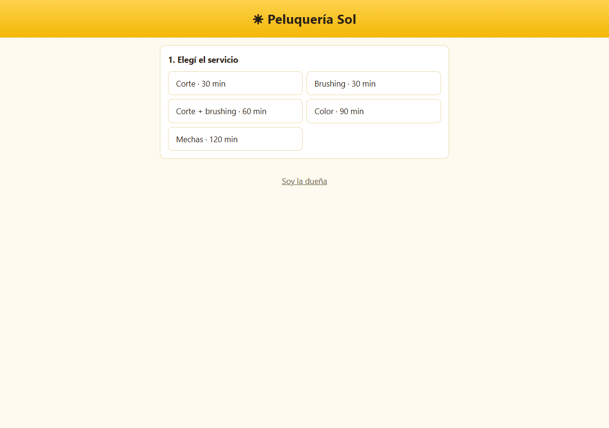 | 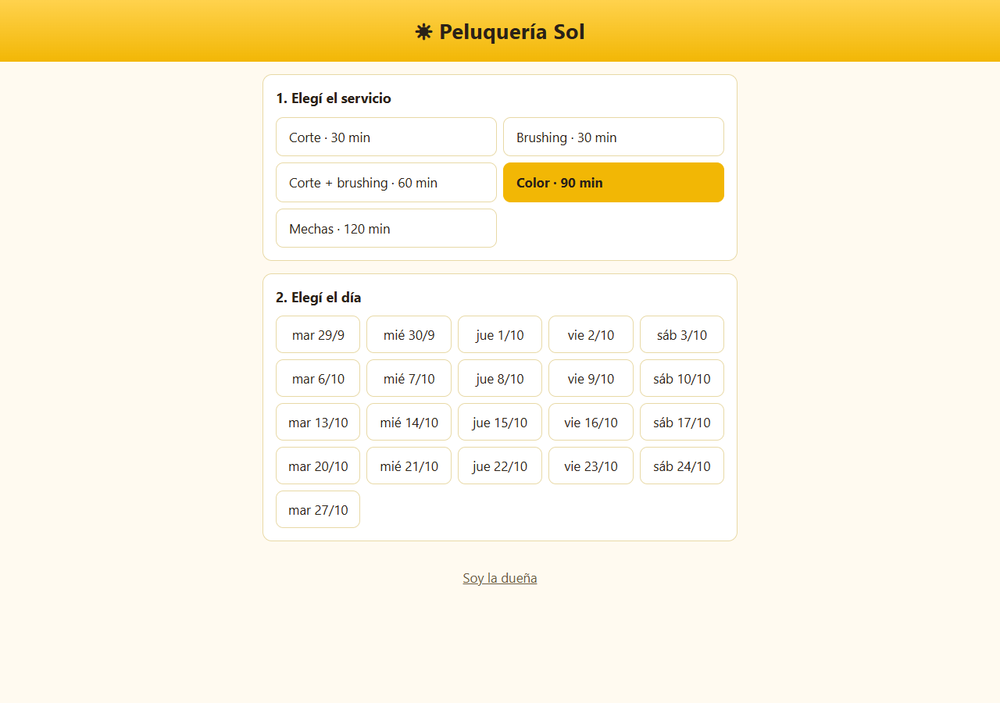 |
| 1 · Elegí el servicio | 2 · Días disponibles (sin domingos ni lunes) |
| 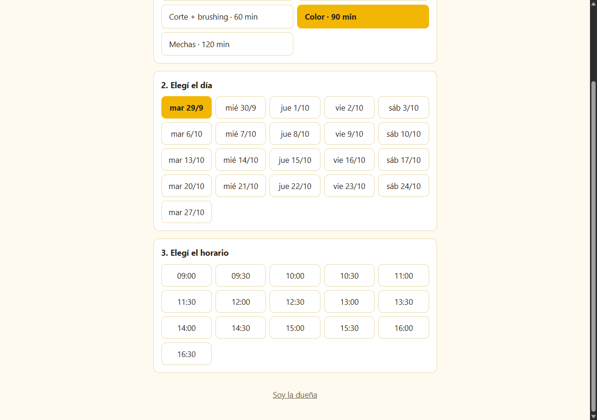 | 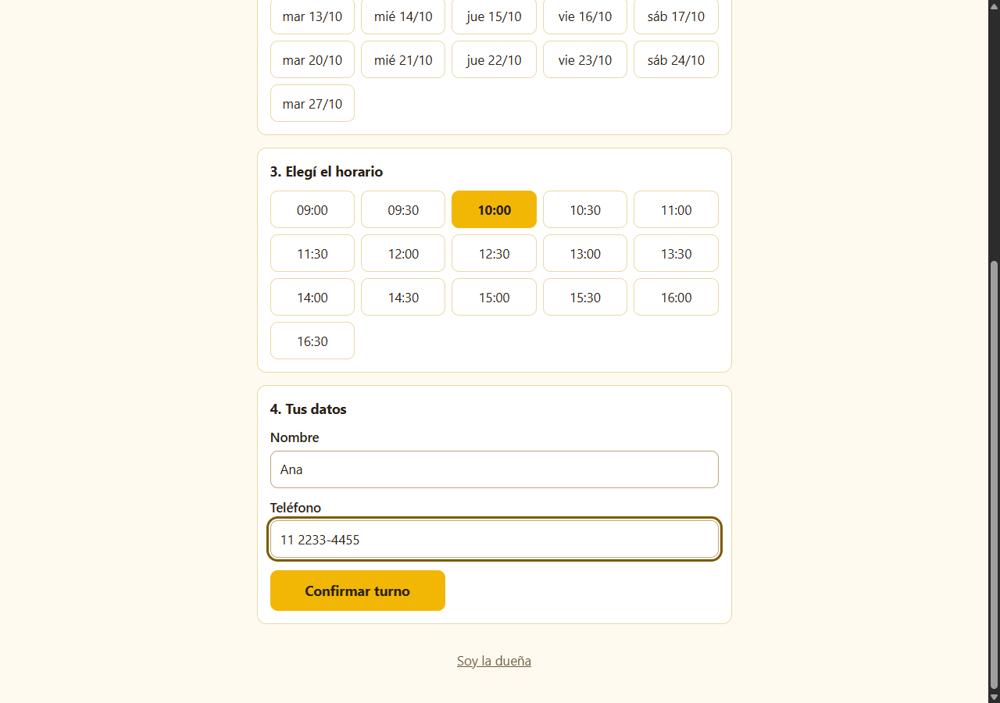 |
| 3 · Horarios libres | 4 · Nombre y teléfono |
| 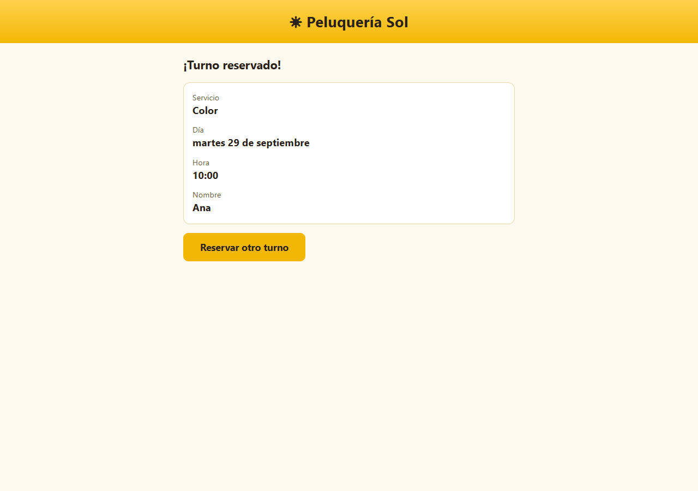 | 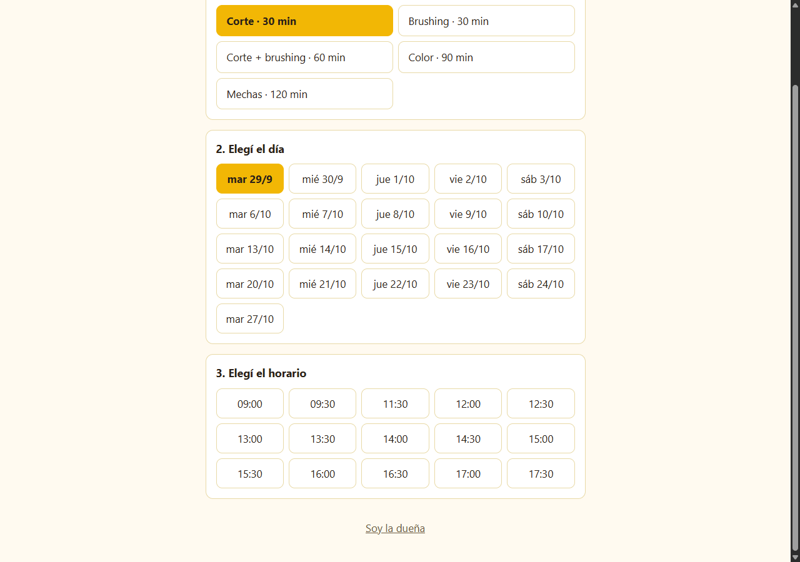 |
| 5 · Turno reservado | 6 · El horario tomado ya no se ofrece |
| 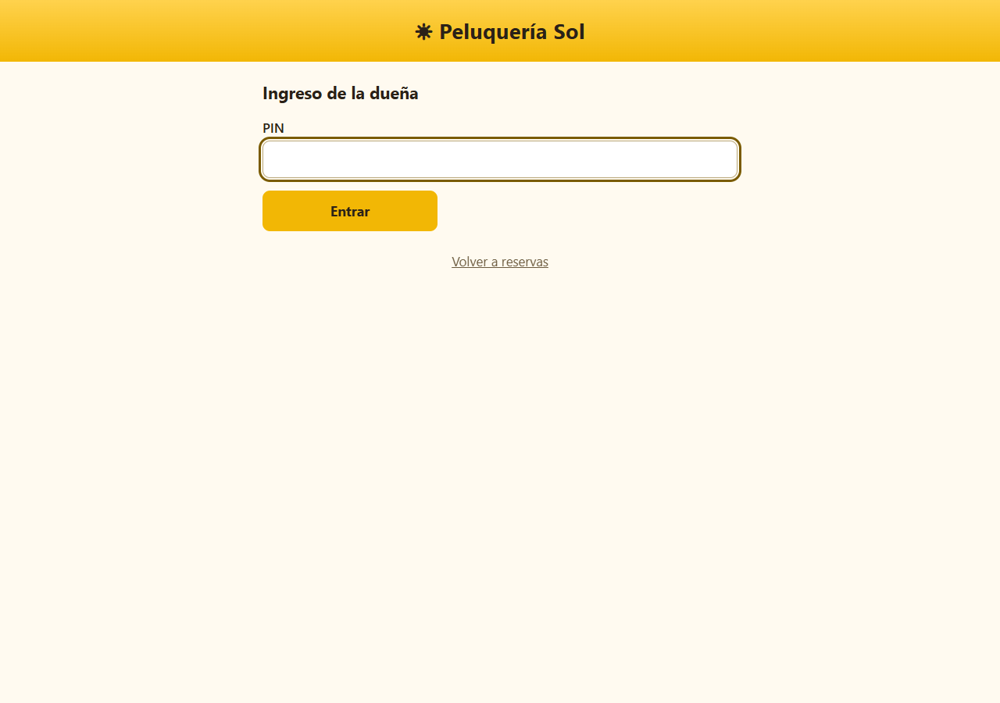 | 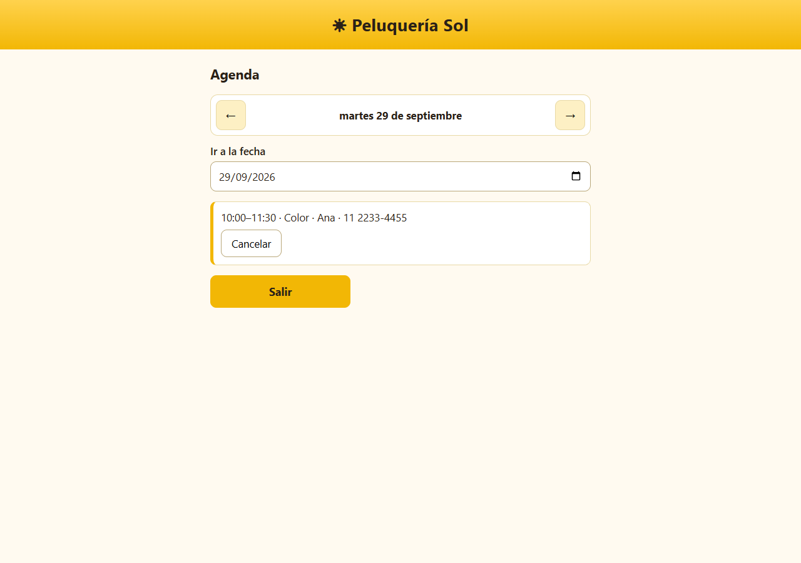 |
| 7 · Entrada de la dueña | 8 · Agenda del día |

### En el celular

| | | |
|---|---|---|
| 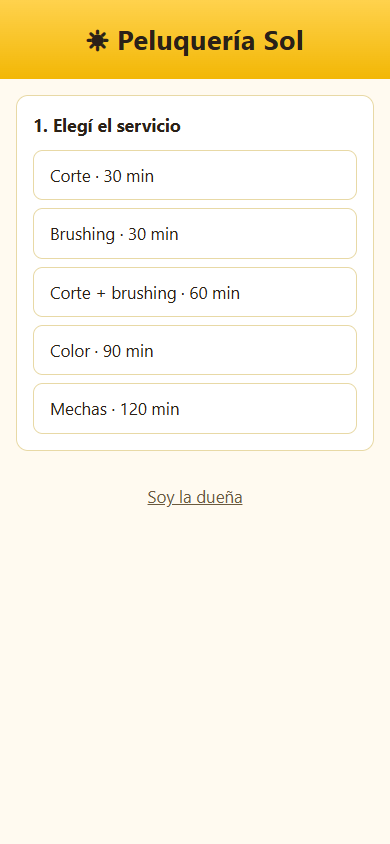 | 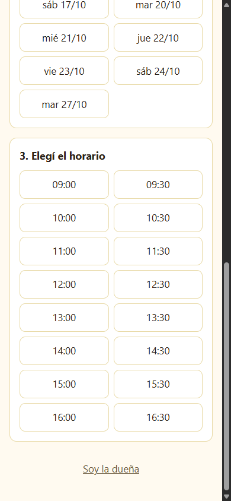 | 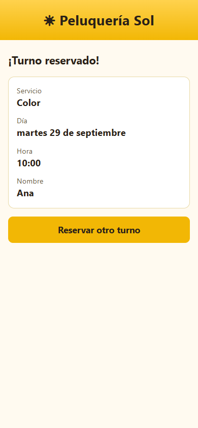 |
| Inicio | Horarios | Turno reservado |
| 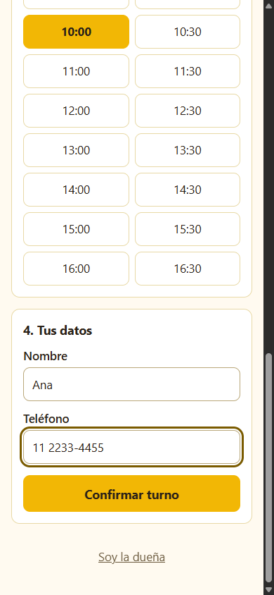 | 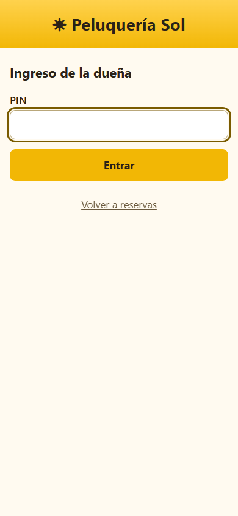 | 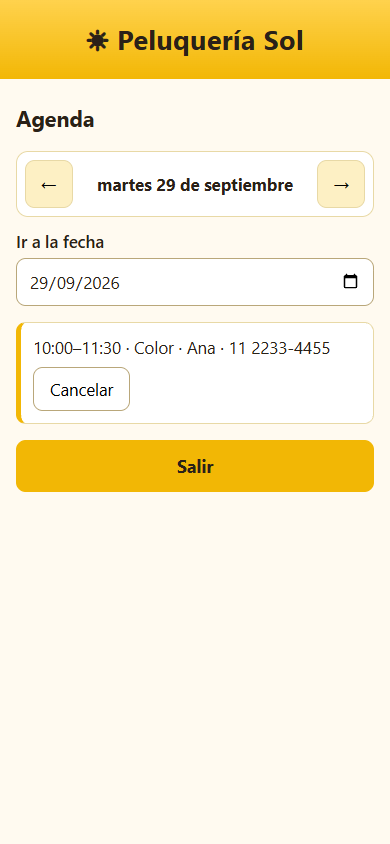 |
| Datos | Entrada de la dueña | Agenda |

## Los archivos

En [`proyecto/`](proyecto/) están los documentos que dejó el método y el código de la web:

- [SPEC.md](proyecto/SPEC.md) · qué se construye (paso 1)
- [PLAN.md](proyecto/PLAN.md) · en qué orden, con el Estado, los Pendientes y las decisiones tomadas en el camino (pasos 2 a 6)
- [DECISIONES.md](proyecto/DECISIONES.md) · por qué se eligió cada cosa
- [CLAUDE.md](proyecto/CLAUDE.md) · las reglas del proyecto
- `index.html`, `estilos.css`, `app.js`, `pruebas.js` · la web y sus pruebas automáticas

## Cómo seguiría este proyecto

La web quedó publicada, pero un proyecto real sigue: la dueña pide cambios, algo falla, pasan semanas. Estos son los casos más comunes con la Peluquería Sol y qué se escribe en cada uno. Todos salen de lo que quedó anotado en el [SPEC.md](proyecto/SPEC.md) ("Fuera de alcance") y en el [PLAN.md](proyecto/PLAN.md) ("Pendientes").

| Si pasa esto | Escribís | Qué hace |
|---|---|---|
| Volvés al proyecto un mes después | `/cdia:empezar` | Muestra el tablero: 3 de 3 fases, publicado, y los pendientes para decidir. |
| La dueña quiere cerrar a las 19:00 | `/cdia:mejorar-prompt cambiá el horario de cierre a las 19:00` | Cambio chico: lo hace directo, sin SPEC ni plan, lo prueba y lo guarda. |
| Quiere que cada cliente reserve desde su celular y le llegue a ella | `/cdia:brainstorming que las reservas desde el celular de cada cliente le lleguen a la dueña` | Función grande (era "Fuera de alcance"): necesita una base de datos, así que pasa por SPEC, plan y fases. |
| Quiere un WhatsApp de confirmación | `/cdia:brainstorming ¿se puede mandar un WhatsApp de confirmación sin pagar?` | Prueba rápida: averigua las opciones y lo que cuestan antes de construir nada. |
| Un cliente avisa que no puede reservar el sábado | `/cdia:arreglar un cliente dice que el sábado no le aparecen horarios` | Reproduce el problema, busca la causa, la arregla y muestra la prueba. |
| Querés resolver un pendiente de la revisión | `/cdia:mejorar-prompt que el teléfono acepte solo números y como máximo 15` | Es uno de los 4 menores del PLAN.md: se hace directo y se tacha en Pendientes. |
| Claude habló de "guardado local" y no lo entendiste | `/cdia:no-entendi qué es el guardado local` | Lo explica con una analogía y qué significa para la peluquería (por qué hoy sirve para una tablet en el mostrador). |
| Querés que alguien vigile la web cada semana | `/cdia:mantener` | Control de salud sin tocar nada y te ofrece dejarlo programado. |

## Cuánto costó

Con Opus y esfuerzo por defecto: cada paso de diseño (empezar, brainstorming, plan) entre USD 0,25 y 0,50; cada fase entre USD 1,20 y 1,40; probar, revisar y publicar alrededor de USD 1 cada uno. Con un plan Pro o Max de Claude, eso sale de la cuota del plan.

---

Plugin CDIA · comunidad CDIA · [cdia.pro](https://www.cdia.pro) · [cómo instalarlo](../../README.md#instalar)
